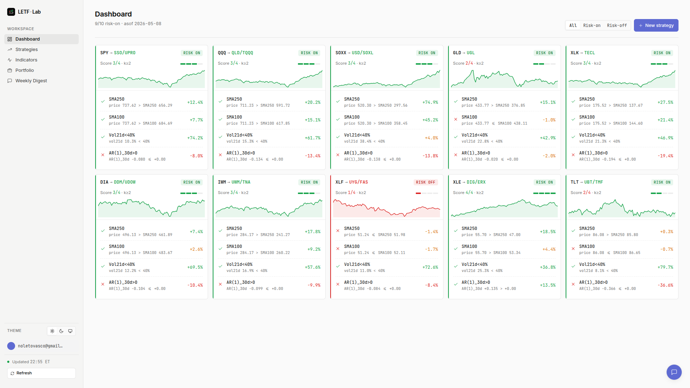

# LETF Lab

LETF Lab is a private research and portfolio-management app for leveraged ETF strategies.

It helps evaluate risk-on/risk-off LETF rotations with signals, backtests, benchmark-relative windows, cohort analysis, validation gates, portfolio tracking, and AI-assisted reports.



## Quick Links

- [Setup and VPS deployment](./SETUP.md)
- [Application context index](./docs/context/SUMMARY.md)
- [Strategy detail context](./docs/context/strategy-detail.md)
- [Validation and robustness context](./docs/context/validation-and-robustness.md)
- [Portfolio context](./docs/context/portfolio.md)

## Stack

- Backend: FastAPI, SQLAlchemy, Alembic, pandas, yfinance, APScheduler.
- Frontend: Angular, standalone components, signals, ECharts.
- Storage: PostgreSQL recommended; SQLite supported for quick local development.
- Auth: JWT in HttpOnly cookie.

## Local Development

```bash
make install
cp backend/.env.example backend/.env
make db-create
make migrate
make seed
make dev
```

Open `http://localhost:4200` and log in with the seeded admin user unless you changed the seed env vars.

## Docker

```bash
cp .env.docker.example .env.docker
docker compose --env-file .env.docker up --build
```

Open `http://localhost:8080` by default. PostgreSQL is exposed on `localhost:15432` by default. Change `APP_HOST_PORT` and `POSTGRES_HOST_PORT` in `.env.docker` if those ports conflict with services on your host. See [Docker usage](./docs/docker.md) for OpenCode/AI setup inside the backend container.

See [SETUP.md](./SETUP.md) for production/VPS instructions.

## Current Scope

- LETF strategy registry and indicator configuration.
- Daily signal snapshots and transitions.
- Backtests with gross/net curves and tax drag.
- Benchmark Edge Windows for rolling `% above benchmark` and final `equity / benchmark`.
- Cohort Entry analysis for historical launch dates.
- Validation Snapshot with statistical/robustness gates.
- Portfolio positions and transactions.
- AI strategy reports, chat, and weekly digest when AI CLI is configured.

## Notes

- `design/` and `docs/superpowers/` are intentionally ignored.
- The Python package is still named `ai_swing` internally; the product/repository name is `LETF Lab` / `letf-lab`.
